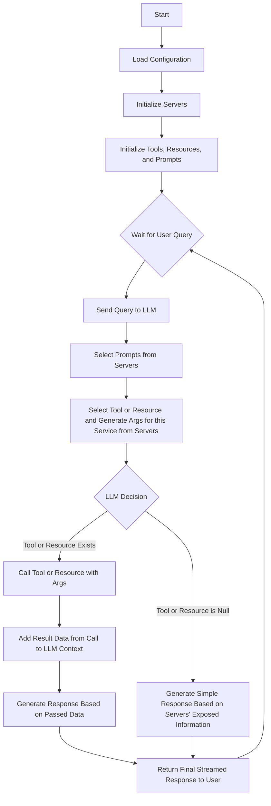
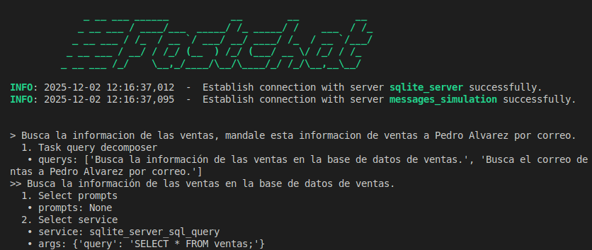

# Technova Agent

Technova Agent es un agente inteligente que orquesta múltiples servicios [MCP](https://modelcontextprotocol.io/docs/getting-started/intro) para consultar datos empresariales y simular el envío de comunicaciones a clientes de manera coherente, trazable y desacoplada. Este repositorio contiene tanto la API del agente como las instrucciones necesarias para ejecutarlo en entornos locales y con contenedores.

> [Probar Technova Agent Web App](https://rb58853.github.io/Technova-Agent-web/)

## Tabla de Contenidos

1. [Descripción general](#descripción-general)
2. [Flujo](#flujo)  
   - [API](#api)
   - [Inicialización del Chat](#inicialización-del-chat)
   - [Agente](#agente)
3. [Arquitectura y MCP conectados](#arquitectura-y-mcp-conectados)
4. [Requisitos previos](#requisitos-previos)
5. [Instalación y ejecución con Uvicorn](#instalación-y-ejecución-con-uvicorn)
6. [Ejecución con Docker / Docker Compose](#ejecución-con-docker--docker-compose)
7. [Uso del agente](#uso-del-agente)
   - [Uso vía interfaz web](#uso-vía-interfaz-web)
   - [Uso local](#uso-local)
8. [Ventajas de usar MCP](#ventajas-de-usar-mcp)
9. [Recursos relacionados](#recursos-relacionados)

## Descripción general

Technova Agent utiliza [Fastchat-MCP](https://github.com/rb58853/fastchat-mcp) como controlador principal y se conecta a dos servidores MCP especializados: uno para consultas sobre la base de datos SQLite de Technova y otro para la simulación de envío de mensajes y correos electrónicos. El objetivo es permitir flujos complejos como extraer información de ventas y, en el mismo flujo, “enviar” dicha información a clientes específicos siguiendo una lógica de negocio razonable.

Entre los escenarios soportados se incluyen, por ejemplo, las siguientes conversaciones:

- Busca la informacion de las ventas, mandale esta informacion de ventas a Pedro Alvarez por correo. [ver conversacion](./doc/chats/Busca%20la%20inform....md)
- Manda la informacion de las todas las ventas generales a cada uno de los clientes de Chile, por correo electronico y por mensaje al telefono. [ver conversacion](./doc/chats/Manda%20la%20inform....md)

## Flujo

> Este flujo destaca por su alto nivel de extensibilidad, escalabilidad y desacoplamiento. Sin realizar ninguna modificación en el código del agente, es posible integrar múltiples servidores MCP adicionales, los cuales se incorporarán de manera transparente con los Servicios existentes.

### API

Para crear o iniciar la API, se deben seguir los siguientes pasos con el fin de utilizar el servicio de `Fastchat-MCP` y adaptarlo a los requerimientos específicos del proyecto:

- Se crea una instancia de `Fastapp` a partir del paquete `Fastchat-MCP`. ([Ver documentación en **Fastapp: REST API & WebSocket Exposure**](https://github.com/rb58853/fastchat-mcp/blob/main/doc/USAGE.md))
- A esta instancia se le proporcionan los *system prompts* y los *service selection prompts* de MCP. ([Ver documentación en **Customizing System Prompts**](https://github.com/rb58853/fastchat-mcp/blob/main/doc/USAGE.md)). Estos prompts están definidos en el archivo [system_prompts.yaml](./src/prompts/system_prompts.yaml).
- Una vez configurada la instancia de `Fastapp`, se ejecuta con [**uvicorn**](#instalación-y-ejecución-con-uvicorn) para exponer un WebSocket al cual se conecta el frontend.

> ver [src/api/server.py](src/api/server.py)

### Inicialización del Chat

- El chat generado por `Fastchat-MCP` recibe una lista de conexiones MCP definidas en el archivo de configuración `fastchat.config.json`. ([Ver doc](https://github.com/rb58853/fastchat-mcp))
- Cada herramienta, recurso y prompt se registra en un [Gestor de MCP](https://github.com/rb58853/fastchat-mcp/blob/main/src/fastchat/app/mcp_manager/client.py). Este gestor es el encargado de establecer las conexiones con los servidores MCP y de ponerlos a disposición del LLM.

### Agente

El flujo de funcionamiento del agente se compone de los siguientes pasos:

- Recibe una consulta del usuario.  
- Divide la consulta en subconsultas, si es necesario, para utilizar múltiples servicios. Por ejemplo, puede separar una tarea para obtener información de ventas y luego enviar dicha información por correo electrónico a un cliente.  
- Para cada una de las *queries*, ejecuta las siguientes acciones:
  - Selecciona los prompts más adecuados desde la lista definida en los MCP.
  - Si existen prompts disponibles, los añade como `system_prompt` o `user_prompt`, según lo definido por el servidor MCP.
  - Busca el servicio correspondiente a la consulta (recurso o herramienta) y genera los argumentos requeridos en caso de encontrarlo.
  - Si el servicio existe, lo invoca a través de una conexión MCP pasándole los argumentos generados. Para ello, `Fastchat-MCP` utiliza [`mcp[cli]`](https://github.com/modelcontextprotocol/python-sdk). Tras recibir la información del servidor, el agente genera una respuesta final con base en los datos obtenidos.
  - Si no existe un servicio adecuado, produce la respuesta final directamente. Además, considera el contexto de los servicios disponibles para ser consciente de sus propias capacidades y de las tareas que puede ejecutar según los servicios expuestos.

- Este proceso se repite por cada subconsulta generada.

Para comprender mejor este flujo, se recomienda consultar [el flujo de `fastchat-mcp`](https://github.com/rb58853/fastchat-mcp/blob/main/doc/FLOW.md):



## Arquitectura y MCP conectados

Technova Agent se apoya en el patrón MCP (Model Context Protocol) para desacoplar responsabilidades entre el agente y los servicios externos. Cada servidor MCP encapsula una capacidad concreta (consultas SQL, envío de mensajes, etc.), lo que facilita la evolución del sistema sin modificar el agente central.

Los MCP utilizados actualmente son:

- [SQLite MCP Server](https://github.com/rb58853/sqlite-mcp-server): Servidor MCP dedicado a ejecutar consultas SQL sobre una base de datos de ejemplo de la empresa Technova. Esta base de datos incluye, al menos, una tabla de ventas y una tabla de clientes, lo que permite responder a preguntas típicas de negocio sobre facturación, clientes y segmentos.
- [MCP-Send-Message-Simulation](https://github.com/rb58853/sqlite-mcp-server): Servidor MCP de simulación que expone herramientas para “enviar” correos electrónicos a listas de direcciones y mensajes a listas de números de teléfono. No realiza envíos reales, sino que permite probar y validar el flujo de comunicación del agente.

Al utilizar MCP, cualquier cambio en el modelo de datos, en el proveedor de mensajería o en servicios adicionales se centraliza en el servidor MCP correspondiente. El agente solo necesita conocer las capacidades expuestas y coordinar un flujo lógico entre ellas, lo que mejora la mantenibilidad y la extensibilidad del sistema.

## Requisitos previos

Para ejecutar el proyecto localmente se recomienda contar con:

- Python 3.x
- Entorno virtual de Python (venv o equivalente)
- Docker y Docker Compose (opcional, para ejecución en contenedores)
- Acceso a los servidores MCP necesarios (SQLite MCP Server y MCP-Send-Message-Simulation) correctamente configurados

Asegúrese también de clonar o tener disponibles los repositorios de los servidores MCP que se van a utilizar y de revisar su documentación específica para configuración detallada.

## Instalación y ejecución con Uvicorn

1. Crear y activar el entorno virtual:

```bash
python -m venv .venv
source .venv/bin/activate
```

2. Instalar las dependencias del proyecto:

```bash
pip install -r requirements.txt
```

3. Iniciar la API con Uvicorn:

```bash
uvicorn src.api.server:app \
  --host 0.0.0.0 \
  --port 8000 \
  --ws-ping-interval 0 \
  --ws-ping-timeout 1200 \
  --workers 1
```

## Ejecución con Docker / Docker Compose

Para facilitar la puesta en marcha del entorno, se recomienda usar Docker Compose. Desde la raíz del proyecto:

```bash
docker compose -f docker-compose.yml up -d --build
```

Este comando construirá la imagen, levantará el contenedor en segundo plano y expondrá la API según la configuración definida en el archivo `docker-compose.yml`. Revise dicho archivo para ajustar puertos, variables de entorno u otros parámetros según sus necesidades (en caso de necesitar cambiarlas).

## Uso del agente

### Uso vía interfaz web

Para una prueba rápida sin necesidad de montar todo el entorno localmente, se proporciona una interfaz web del agente disponible en:

- <https://rb58853.github.io/Technova-Agent-web/>

Esta opción es útil para explorar el flujo de trabajo del agente y validar casos de usos sin necesidad de montar todos los servicios local.

### Uso local

Para ejecutar el agente de forma local y completa, siga estos pasos generales:

1. Levantar los servidores MCP requeridos:
    - Servidor SQLite MCP. [ver doc](https://github.com/rb58853/sqlite-mcp-server)
    - Servidor de envío de mensajes. [ver doc](https://github.com/rb58853/MCP-Send-Message-Simulation)
2. Configurar el archivo `fastchat.config.json` con la información de conexión a cada MCP (host, puerto, herramientas, etc.), siguiendo las [instrucciones oficiales de Fastchat-MCP](https://github.com/rb58853/fastchat-mcp).
3. Ejecutar el cliente de terminal para interactuar con el agente desde el script [`terminal_chat.py`](./src/terminal_chat.py), Este script permite probar el agente desde la línea de comandos.


## Ventajas de usar MCP

El uso de MCP en lugar de un flujo monolítico o acoplado ofrece varias ventajas:

- Alto desacoplamiento: las responsabilidades de acceso a datos, mensajería y otros servicios se encapsulan en servidores independientes, lo que reduce la complejidad en el agente.
- Escalabilidad funcional: agregar nuevos servicios (por ejemplo, otro tipo de base de datos o un proveedor de notificaciones distinto) implica incorporar nuevos MCP o extender los existentes, sin reescribir la lógica central del agente.
- Mantenibilidad: los cambios en la implementación de un servicio (consultas, validaciones, formatos de mensajes) se realizan a nivel del servidor MCP, manteniendo estable la interfaz hacia el agente.
- Reutilización: un mismo servidor MCP puede ser consumido por diferentes agentes o aplicaciones, promoviendo la reutilización de componentes.

Esta arquitectura hace que Technova Agent sea una base sólida para experimentos con agentes que combinan capacidades de LLM con servicios empresariales externos.

## Recursos relacionados

Para ampliar la información sobre el flujo del agente y los servicios utilizados, consulte:

- Flujo del agente (diagrama y explicación):
<https://github.com/rb58853/fastchat-mcp/blob/main/doc/FLOW.md>
- Fastchat-MCP (controlador del agente):
<https://github.com/rb58853/fastchat-mcp>
- SQLite MCP Server (consultas a la base de datos de Technova):
<https://github.com/rb58853/sqlite-mcp-server>
- MCP-Send-Message-Simulation (simulación de envío de correos y mensajes):
<https://github.com/rb58853/MCP-Send-Message-Simulation>
- Fastauth-API (autenticación, si aplica en su configuración):
<https://github.com/rb58853/fastauth-api>
- Python MCP SDK (SDK oficial para implementar servidores MCP en Python):
<https://github.com/modelcontextprotocol/python-sdk>
